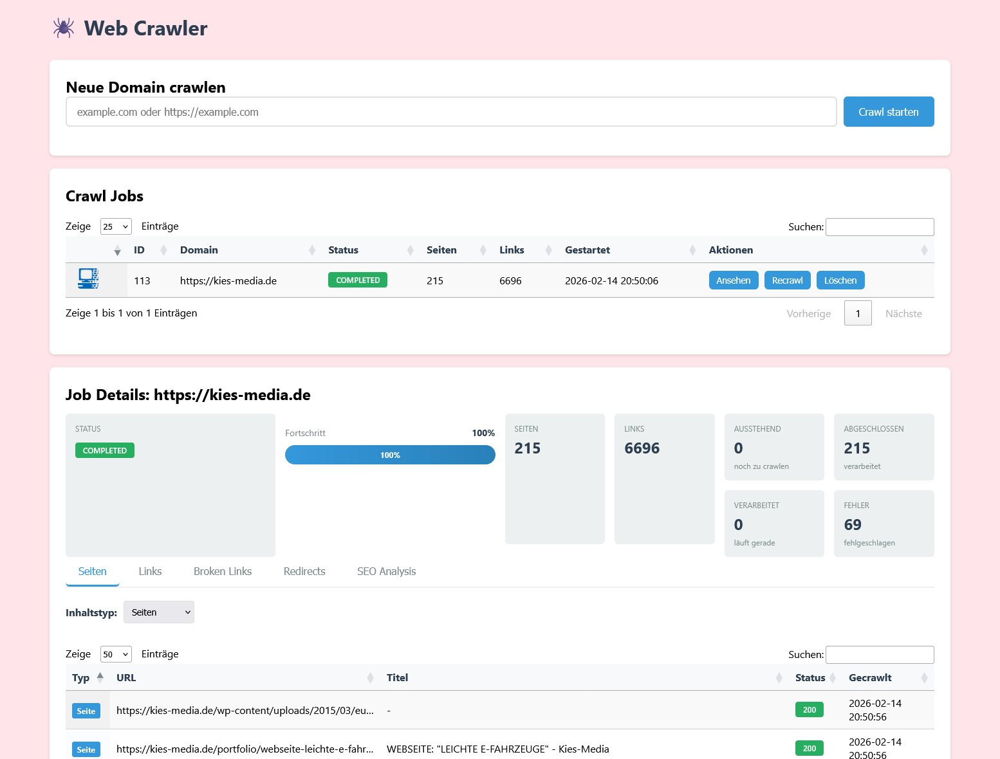

# Web Crawler - Freies Analysetool

[](https://github.com/Martin-Kiesewetter/Web-Crawler/actions/workflows/phpcsci.yml) [](https://github.com/Martin-Kiesewetter/Web-Crawler/actions/workflows/phpstan.yml) [](https://github.com/Martin-Kiesewetter/Web-Crawler/actions/workflows/phpunit.yml)
---

Eine leistungsstarke PHP-basierte Web-Crawler-Anwendung mit MariaDB, die in Docker läuft. Der Crawler extrahiert und analysiert Seiten, Links, Bilder und JavaScript-Dateien mit umfangreichen Metadaten.

[](docs/img/Firefox_Screenshot_2026-02-14T21-26-54.462Z.png)

## Copyright & Lizenz

- [](https://creativecommons.org/licenses/by/4.0/)
- **Kernentwickler:** Martin Kiesewetter
- **E-Mail:** mki@kies-media.de
- **Website:** [https://kies-media.de](https://kies-media.de)

---

## Features

### 🕷️ Crawling-Funktionen
- **Paralleles Crawling** - 10 gleichzeitige HTTP-Requests für maximale Performance
- **Intelligente Link-Extraktion** - Erkennt interne/externe Links, nofollow-Attribute
- **Bild-Extraktion** - Sammelt Bilder mit Alt-Text, Titel, Dimensionen, Responsive-Erkennung
- **JavaScript-Extraktion** - Erfasst externe JavaScript-Dateien mit Metadaten
- **Favicon-Extraktion** - Automatische Erkennung von Website-Favicons
- **Duplikat-Erkennung** - Crawlt jede externe Datei nur einmal pro Job
- **Asset-Typ-Erkennung** - Unterscheidet automatisch zwischen Seiten, Bildern und Scripts

### 📊 Metadaten-Erfassung
- **Seiten:** URL, Titel, Meta-Description, Status-Code, Content-Type, Redirects, Favicon
- **Bilder:** URL, Alt-Text, Titel, Status-Code, Dateigröße, Breite, Höhe, Responsive-Flag, Redirects
- **Scripts:** URL, Status-Code, Content-Type, Dateigröße, Content-Hash, Redirects
- **Links:** Quelle, Ziel, Link-Text, Nofollow, Intern/Extern

### 🎨 Benutzeroberfläche
- **Live-Progress-Tracking** - Echtzeit-Fortschrittsanzeige während des Crawls
- **Asset-Filter** - Dropdown-Filter für Seiten, Bilder und Scripts
- **DataTables-Integration** - Sortierbare, durchsuchbare Tabellen
- **Job-Verwaltung** - Recrawl und Löschen von Jobs
- **SEO-Analyse** - Titel- und Meta-Description-Längenprüfung
- **Broken-Links-Erkennung** - Automatische Erkennung defekter Links
- **Redirect-Analyse** - Übersicht über Weiterleitungen

### 🔧 Technische Features
- **Docker-basiert** - Einfache Installation und Deployment
- **PSR-12 konform** - Sauberer, standardisierter Code
- **PHPStan Level 8** - Höchste Typsicherheit
- **Umfassende Tests** - 35 Unit- und Integrationstests
- **Guzzle HTTP Client** - Robuste HTTP-Requests mit Redirect-Tracking
- **Symfony DomCrawler** - Zuverlässiges HTML-Parsing

## Anforderungen

- Docker
- Docker Compose

## Installation & Start

1. Container starten:
```bash
docker-compose up -d
```

2. Container stoppen:
```bash
docker-compose down
```

3. Container neu bauen:
```bash
docker-compose up -d --build
```

## Services

- **Web Crawler UI**: http://localhost:8080
- **phpMyAdmin**: http://localhost:8081
- **MariaDB**: Port 3306

## Datenbank Zugangsdaten

- **Host**: mariadb
- **Datenbank**: app_database
- **Benutzer**: app_user
- **Passwort**: app_password
- **Root Passwort**: root_password

## Verwendung

1. Öffne http://localhost:8080 im Browser
2. Gib eine Domain ein (z.B. `example.com` oder `https://example.com`)
3. Drücke Enter oder klicke auf "Crawl starten"
4. Beobachte den Live-Fortschritt in der Job-Details-Ansicht
5. Nutze die Tabs und Filter, um die Ergebnisse zu analysieren:
   - **Seiten** - Alle gecrawlten Assets mit Typ-Filter
   - **Links** - Extrahierte Links mit Nofollow/Intern-Markierung
   - **Broken Links** - Defekte URLs (4xx, 5xx)
   - **Redirects** - Weiterleitungen mit Statistiken
   - **SEO Analysis** - Titel- und Meta-Description-Probleme

## Struktur

```
.
├── docker-compose.yml      # Docker Compose Konfiguration
├── Dockerfile              # PHP Container Image
├── composer.json           # PHP Dependencies
├── phpunit.xml             # PHPUnit Konfiguration
├── phpstan.neon            # PHPStan Konfiguration (Level 8)
├── phpcs.xml               # PHPCS Konfiguration (PSR-12)
├── AGENTS.md               # Entwickler-Guidelines
├── config/                 # Konfigurationsdateien
│   ├── docker/
│   │   ├── init.sql        # Datenbank Schema
│   │   └── start.sh        # Container Start-Script
│   └── nginx/
│       └── default.conf    # Nginx Konfiguration
├── public/                 # Öffentliche Assets
│   ├── css/
│   └── js/
├── src/                    # Anwendungscode
│   ├── index.php           # Frontend UI
│   ├── api.php             # REST API
│   ├── crawler-worker.php  # Background Crawler Worker
│   ├── composer.json       # Composer Config
│   ├── public/             # UI Assets
│   │   ├── css/
│   │   │   └── index.css
│   │   └── js/
│   │       └── index.js
│   └── classes/
│       ├── Config.php      # Konfigurationskonstanten
│       ├── Crawler.php     # Haupt-Crawler-Logik
│       └── Database.php    # Datenbank-Singleton
└── tests/                  # Test Suite
    ├── Unit/               # Unit Tests
    │   ├── CrawlerTest.php
    │   ├── DatabaseTest.php
    │   └── ConfigTest.php
    ├── Feature/            # Feature Tests
    │   ├── ApiTest.php
    │   └── SecurityTest.php
    └── Integration/        # Integration Tests
        └── CrawlerIntegrationTest.php
```

## Datenbank-Schema

### Tabellen

- **crawl_jobs** - Crawl-Jobs mit Status und Statistiken
- **pages** - Gecrawlte Seiten mit Metadaten
- **links** - Extrahierte Links
- **images** - Extrahierte Bilder mit Metadaten
- **scripts** - Extrahierte JavaScript-Dateien
- **crawl_queue** - Verarbeitungs-Queue für paralleles Crawling

## Entwicklung

Die Anwendungsdateien befinden sich im `src/` Verzeichnis und werden als Volume in den Container gemountet, sodass Änderungen sofort sichtbar sind.

### Entwickler-Guidelines

Siehe `AGENTS.md` für detaillierte Informationen zu:
- Projekt-Struktur und Modul-Organisation
- Build-, Test- und Entwicklungs-Commands
- Coding-Style und Namenskonventionen
- Testing-Guidelines
- Commit- und Pull-Request-Guidelines

## Tests & Code-Qualität

### Unit Tests ausführen

Die Anwendung verwendet PHPUnit für Unit- und Integrationstests:

```bash
# Alle Tests ausführen
docker-compose exec php php vendor/bin/phpunit /var/www/tests/

# Alternative mit Composer-Script
docker-compose exec php composer test
```

**Test-Statistik:**
- Unit Tests: Crawler, Database, Config
- Feature Tests: API, Security
- Integration Tests: Full Crawl Workflows

Die Tests befinden sich in:
- `tests/Unit/` - Unit Tests für einzelne Komponenten
- `tests/Feature/` - Feature Tests für API und Security
- `tests/Integration/` - Integration Tests für vollständige Crawl-Workflows

### Statische Code-Analyse mit PHPStan

PHPStan ist auf Level 8 (höchstes Level) konfiguriert und analysiert den gesamten Code:

```bash
# PHPStan ausführen
docker-compose exec php sh -c "php -d memory_limit=512M /var/www/html/vendor/bin/phpstan analyse -c /var/www/phpstan.neon"

# Alternative mit Composer-Script
docker-compose exec php composer phpstan
```

**PHPStan Konfiguration:**
- Level: 8 (strictest)
- Analysierte Pfade: `src/` und `tests/`
- Ausgeschlossen: `vendor/` Ordner
- Konfigurationsdatei: `phpstan.neon`

### Code Style Prüfung mit PHP_CodeSniffer

PHP_CodeSniffer (PHPCS) prüft den Code gegen PSR-12 Standards:

```bash
# Code Style prüfen
docker-compose exec php composer phpcs

# Code Style automatisch korrigieren
docker-compose exec php composer phpcbf
```

**PHPCS Konfiguration:**
- Standard: PSR-12
- Analysierte Pfade: `src/` und `tests/`
- Ausgeschlossen: `vendor/` Ordner
- Auto-Fix verfügbar mit `phpcbf`

## API-Endpunkte

Die REST API ist unter `/api.php` verfügbar. Die vollständige API-Dokumentation ist im OpenAPI/Swagger-Format verfügbar:

[](https://petstore.swagger.io/?url=https://raw.githubusercontent.com/Martin-Kiesewetter/Web-Crawler/main/docs/openapi.yaml)

### Schnellübersicht

| Methode | Endpunkt | Beschreibung |
|---------|----------|--------------|
| `POST` | `/api.php?action=start` | Startet einen neuen Crawl-Job |
| `GET` | `/api.php?action=status&job_id=X` | Job-Status und Queue-Statistiken |
| `GET` | `/api.php?action=jobs` | Liste aller Crawl-Jobs |
| `GET` | `/api.php?action=pages&job_id=X` | Gecrawlte Seiten |
| `GET` | `/api.php?action=links&job_id=X` | Extrahierte Links |
| `GET` | `/api.php?action=images&job_id=X&filter=all` | Extrahierte Bilder |
| `GET` | `/api.php?action=assets&job_id=X&type=all` | Alle Assets |
| `GET` | `/api.php?action=broken-links&job_id=X` | Defekte Links |
| `GET` | `/api.php?action=seo-analysis&job_id=X` | SEO-Analyse |
| `GET` | `/api.php?action=redirects&job_id=X` | Redirect-Analyse |
| `POST` | `/api.php?action=recrawl` | Job neu crawlen |
| `POST` | `/api.php?action=delete` | Job löschen |

> 📖 **Vollständige Dokumentation:** Siehe [`docs/openapi.yaml`](docs/openapi.yaml) für detaillierte Parameter, Schemas und Response-Formate.

## Performance-Optimierungen

- **Parallele Requests:** 10 gleichzeitige HTTP-Requests
- **Duplikat-Erkennung:** Externe Assets werden nur einmal gecrawlt
- **Partial Content:** Bild-Dimensionen werden mit Range-Requests ermittelt (nur erste 32KB)
- **Content-Hash:** Scripts < 500KB werden gehasht für Duplikat-Erkennung
- **Database Indexing:** Optimierte Indizes für schnelle Abfragen
- **ON DUPLICATE KEY UPDATE:** Effiziente Datenbank-Updates

## Bekannte Einschränkungen

- Crawl-Tiefe ist auf 50 Ebenen begrenzt (konfigurierbar in `Config.php`)
- Maximale Redirects: 10 (konfigurierbar)
- Inline-JavaScript wird nicht extrahiert (nur externe Dateien)

## Troubleshooting

### Container starten nicht
```bash
docker-compose down
docker-compose up -d --build --force-recreate
```

### Tests schlagen fehl
```bash
# Container neu starten
docker-compose restart php

# Composer Dependencies neu installieren
docker-compose exec php composer install
```

### Datenbank zurücksetzen
```bash
docker-compose down -v
docker-compose up -d
```